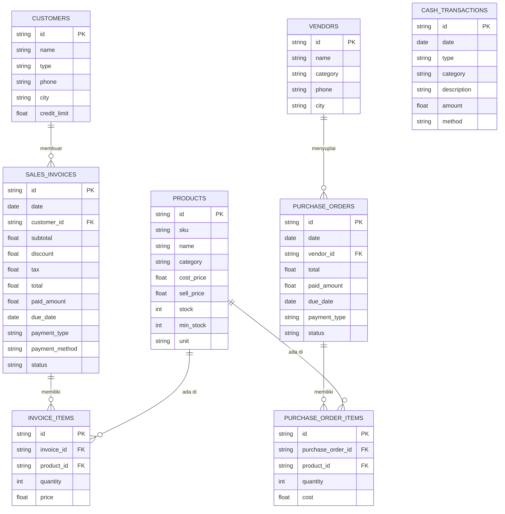

# PRD — Project Requirements Document

## 1. Overview
**SupplierPro** adalah aplikasi web mini ERP untuk UMKM supplier, distributor kecil, dan grosir di Indonesia. Aplikasi ini menggabungkan dashboard operasional, modul penjualan (kasir), manajemen stok, hutang-piutang, serta laporan keuangan sederhana dalam satu antarmuka modern.

**Masalah yang diselesaikan:**
- Pencatatan manual di buku/Excel yang rawan salah dan lambat.
- Kesulitan memantau piutang pelanggan dan hutang ke vendor.
- Stok barang tidak sinkron dengan transaksi penjualan/pembelian.
- Tidak ada visibilitas cepat terhadap laba/rugi bulanan.
- Invoice dan pembayaran tempo tidak terdokumentasi dengan baik.

**Tujuan utama:**
- Memberikan alat bantu operasional sehari-hari yang mudah digunakan.
- Meningkatkan profesionalisme pencatatan bisnis UMKM.
- Menyediakan laporan keuangan sederhana (laba rugi, neraca, arus kas) untuk pengambilan keputusan.
- Menjadi showcase kemampuan AI coding dalam membangun aplikasi bisnis nyata.

## 2. Requirements
1. **Fungsional:**  
   - Landing page komersial dengan CTA demo.  
   - Dashboard ringkasan bisnis (omzet, piutang, stok, laba).  
   - Modul order/kasir untuk transaksi penjualan (tunai, tempo, DP).  
   - Manajemen produk, stok, pelanggan, dan vendor.  
   - Pencatatan pembelian barang dari vendor.  
   - Modul finance: piutang, hutang, arus kas, laba rugi, neraca sederhana.  
   - Laporan bisnis dengan insight sederhana.  
   - Pengaturan profil bisnis dan preferensi invoice.

2. **Non-fungsional:**  
   - UI modern, bersih, B2B-friendly dengan palet warna emerald/blue/indigo.  
   - Responsif untuk desktop dan tablet.  
   - Data dummy realistis (produk, pelanggan, transaksi khas UMKM Indonesia).  
   - Format mata uang Rupiah dan istilah lokal (piutang, tempo, reseller).  
   - State disimpan di localStorage untuk demonstrasi.  
   - Tidak memerlukan login untuk versi showcase.

## 3. Core Features
- **Landing Page** dengan hero, problem, solusi, fitur, pricing, dan CTA.
- **Dashboard** dengan 8 ringkasan bisnis dan chart penjualan.
- **Order/Kasir Supplier** – grid produk, keranjang, pilih pelanggan, diskon, pilih metode & tipe pembayaran, checkout otomatis kurangi stok dan catat piutang jika tempo.
- **Manajemen Produk & Stok** – tabel produk, badge stok, tambah/edit/hapus dummy, catat HPP dan harga jual.
- **Pelanggan** – daftar reseller/warung/kafe, limit piutang, riwayat order.
- **Vendor** – daftar pemasok, total pembelian, hutang.
- **Pembelian** – form PO, pilih vendor, tambah item, stok bertambah, hutang tercatat otomatis.
- **Transaksi/Invoice** – riwayat invoice, detail, tandai dibayar.
- **Finance – Piutang** – tabel piutang, filter status, input pembayaran.
- **Finance – Hutang** – tabel hutang vendor, input pembayaran.
- **Finance – Arus Kas** – mutasi kas masuk/keluar manual & otomatis.
- **Finance – Laba Rugi** – laporan periodik pendapatan, HPP, beban, laba bersih.
- **Finance – Neraca** – aset, liabilitas, ekuitas sederhana.
- **Laporan** – insight penjualan, produk terlaris, pelanggan teratas.
- **Pengaturan** – profil bisnis, pajak, termin default, catatan invoice.

## 4. User Flow
1. Pengguna membuka landing page dan tertarik dengan value proposition.
2. Klik “Coba Demo” untuk masuk ke dashboard aplikasi tanpa login.
3. Di dashboard melihat ringkasan: omzet, piutang, stok menipis, dll.
4. Membuat order baru:  
   a. Pilih pelanggan dari daftar.  
   b. Pilih produk dari grid/katalog.  
   c. Atur jumlah, diskon.  
   d. Tentukan tipe & metode pembayaran (misal: Tempo 7 hari, Transfer Bank).  
   e. Klik “Buat Invoice” – stok berkurang, invoice tercatat, piutang muncul.
5. Untuk pembayaran piutang, buka modul Piutang, pilih invoice, input pembayaran, status berubah.
6. Mencatat pembelian dari vendor:  
   a. Pilih vendor.  
   b. Tambah item & harga beli.  
   c. Pilih pembayaran (Lunas/Tempo).  
   d. Simpan – stok bertambah, hutang tercatat.
7. Memantau laporan laba rugi bulan ini, melihat aset dan hutang di neraca, serta arus kas.
8. Demo selesai, menunjukkan seluruh fitur dalam satu alur.

## 5. Architecture
Aplikasi menggunakan **TanStack Start** sebagai framework full-stack dengan React di sisi klien dan server (SSR/API routes). Struktur routing berbasis file di direktori `routes`. Data dummy di-load dari file TypeScript/JSON, operasi baca/tulis dilakukan melalui **API routes** di bawah `/api` (misal: `POST /api/orders`, `GET /api/products`). State klien dikelola dengan Zustand, sedangkan penyimpanan data (untuk demo) disimpan di localStorage atau memori server melalui API sederhana yang memodifikasi file JSON (atau nantinya dengan Drizzle ORM + SQLite untuk persistensi nyata).

```mermaid
flowchart TD
    Client[Browser: React App]
    Server[TanStack Start Server: SSR + API Routes]
    API[API Routes (server/ atau api/)]
    DB[(SQLite via Drizzle ORM)]
    LS[localStorage (jika fallback)]

    Client -->|Fetch /api/*| Server
    Server --> API
    API --> DB
    API ---|Opsional untuk demo tanpa DB| LS
    Server -->|SSR awal| Client
```

**Alur utama:**
- Landing page dirender SSR oleh TanStack Start.
- Dashboard dan modul aplikasi dimuat sebagai React SPA setelah login (atau tanpa login untuk demo).
- Semua mutasi data (order, pembelian, pembayaran) dikirim ke API routes yang memvalidasi dan menyimpan ke database SQLite (atau fallback ke in-memory store untuk demo).
- Halaman yang membutuhkan data server-side (SSR) akan mengambil data langsung di `loader` TanStack Start, sedangkan interaksi setelahnya menggunakan fetch API.

## 6. Database Schema
Tabel utama yang diperlukan (untuk versi produksi dengan Drizzle ORM + SQLite):

- **products**: id, sku, name, category, cost_price, sell_price, stock, min_stock, unit
- **customers**: id, name, type, phone, city, credit_limit
- **vendors**: id, name, category, phone, city
- **sales_invoices**: id, date, customer_id, subtotal, discount, tax, total, paid_amount, due_date, payment_type, payment_method, status
- **invoice_items**: id, invoice_id, product_id, quantity, price
- **purchase_orders**: id, date, vendor_id, total, paid_amount, due_date, payment_type, status
- **purchase_order_items**: id, purchase_order_id, product_id, quantity, cost
- **cash_transactions**: id, date, type (IN/OUT), category, description, amount, method
- **business_settings**: id, key, value (untuk pengaturan)



## 7. Tech Stack
- **Framework Full-Stack:** TanStack Start (React, TypeScript, SSR, API routes)
- **Frontend:** React, Tailwind CSS, shadcn/ui, Lucide React, Recharts, TanStack Table
- **Backend/API:** TanStack Start API routes (server-side logic)
- **Database:** SQLite dengan Drizzle ORM (untuk persistensi data, bisa diganti dengan file JSON untuk demo).Jika produksi, bisa naik ke 
- **State Management:** Zustand (client state) + TanStack Query (server state)
- **Autentikasi (opsional untuk showcase):** Better Auth dengan adapter kustom untuk TanStack Start (atau Lucia Auth)
- **Deployment:** Vercel / Cloudflare Workers / Node.js server (sesuai dukungan TanStack Start)