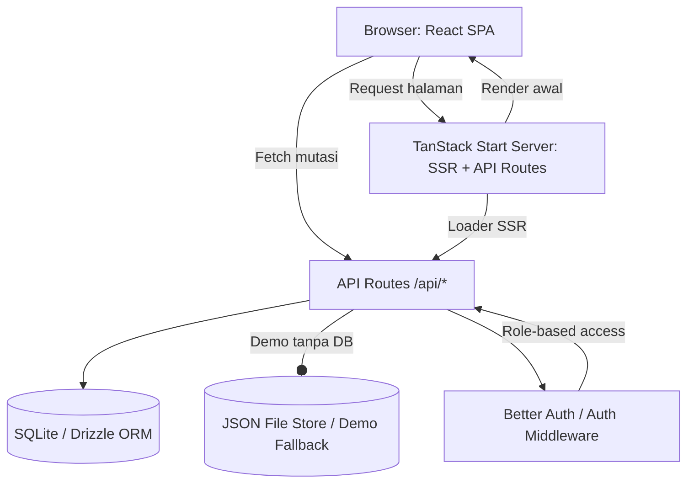
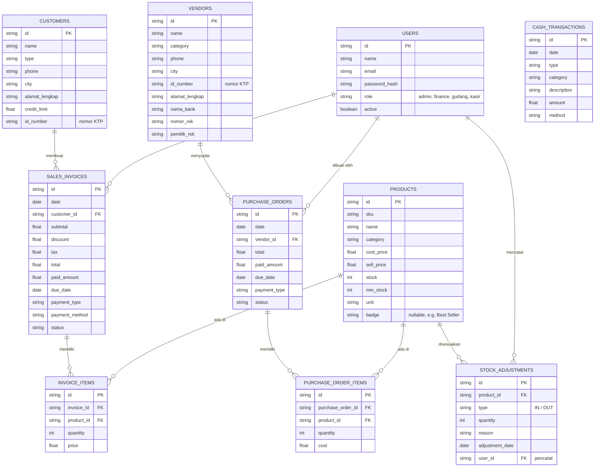

# PRD — Project Requirements Document## 1. Overview
**SupplierPro** adalah aplikasi web mini ERP untuk UMKM supplier, distributor kecil, dan grosir di Indonesia. Aplikasi ini menggabungkan dashboard operasional, modul penjualan (kasir), manajemen stok, hutang-piutang, serta laporan keuangan sederhana dalam satu antarmuka modern.

**Masalah yang diselesaikan:**
- Pencatatan manual di buku/Excel yang rawan salah dan lambat.
- Kesulitan memantau piutang pelanggan dan hutang ke vendor.
- Stok barang tidak sinkron dengan transaksi penjualan/pembelian.
- Tidak ada visibilitas cepat terhadap laba/rugi bulanan.
- Invoice dan pembayaran tempo tidak terdokumentasi dengan baik.
- Proses input data produk/pelanggan yang repetitif tanpa bantuan impor massal.
- Kolaborasi tim kecil (kasir, gudang, finance) tanpa manajemen akses terpusat.

**Tujuan utama:**
- Memberikan alat bantu operasional sehari-hari yang mudah digunakan.
- Meningkatkan profesionalisme pencatatan bisnis UMKM.
- Menyediakan laporan keuangan sederhana (laba rugi, neraca, arus kas) untuk pengambilan keputusan.
- Menjadi showcase kemampuan AI coding dalam membangun aplikasi bisnis nyata.
- Mendukung manajemen pengguna internal dengan peran berbeda.

## 2. Requirements
1. **Fungsional:**  
   - Landing page komersial dengan CTA demo.  
   - Dashboard ringkasan bisnis (omzet, piutang, stok, laba).  
   - Modul order/kasir untuk transaksi penjualan (tunai, tempo, DP) dengan pencarian pelanggan real-time di keranjang.  
   - Manajemen produk & stok: pemilihan badge produk, pencatatan stok opname (tambah/kurangi/hapus), impor data produk via file Excel, serta template unduhan.  
   - Manajemen pelanggan & vendor: tambah data dengan nomor KTP, limit piutang, dan histori transaksi.  
   - Pencatatan pembelian barang (PO) dari vendor dengan dukungan banyak item dalam satu PO.  
   - Modul finance: piutang, hutang, arus kas, laba rugi, neraca sederhana.  
   - Laporan bisnis dengan insight sederhana.  
   - Pengaturan profil bisnis dan preferensi invoice.  
   - Modul admin untuk mengelola pengguna staf (kasir, gudang, finance) beserta hak akses.

2. **Non-fungsional:**  
   - UI modern, bersih, B2B-friendly dengan palet warna emerald/blue/indigo.  
   - Responsif untuk desktop dan tablet.  
   - Data dummy realistis (produk, pelanggan, transaksi khas UMKM Indonesia).  
   - Format mata uang Rupiah dan istilah lokal (piutang, tempo, reseller).  
   - State disimpan di database SQLite untuk persistensi, dengan opsi fallback ke file JSON untuk demo cepat.  
   - Login sederhana untuk membedakan peran (admin, staf) — tidak wajib di versi demo.

## 3. Core Features
- **Landing Page** – hero, problem, solusi, fitur, pricing, dan CTA “Coba Demo”.
- **Dashboard** – 8 ringkasan bisnis dan chart penjualan 30 hari terakhir.
- **Order / Kasir Supplier**  
  - Tampilan grid produk dengan pencarian teks.  
  - Keranjang belanja: input pencarian pelanggan (bukan hanya dropdown) untuk memilih dari daftar dengan cepat.  
  - Atur jumlah, diskon per item, pilih metode & tipe pembayaran (tunai, tempo, DP).  
  - Checkout otomatis kurangi stok, buat invoice, dan catat piutang jika tempo.
- **Manajemen Produk & Stok**  
  - Tabel produk dengan kolom badge (misal: “Best Seller”, “New”, “Segera Habis”).  
  - Form tambah/edit produk lengkap dengan HPP dan harga jual.  
  - **Stok Opname**: fitur tambah/edit/hapus penyesuaian stok (alasan, jumlah, tanggal) untuk sinkronisasi fisik.  
  - **Import Data**: unggah file Excel (.xlsx) untuk menambah banyak produk sekaligus; sediakan template Excel yang bisa diunduh.
- **Pelanggan** – daftar reseller/warung/kafe, lengkapi dengan kolom **nomor KTP**, limit piutang, dan riwayat order.
- **Vendor** – daftar pemasok, tambahkan kolom **nomor KTP**, total pembelian, dan saldo hutang.
- **Pembelian (PO)**  
  - Form PO baru: pilih vendor, lalu tambahkan **banyak item produk** (multi-line) dengan harga beli.  
  - Pilih status pembayaran (lunas/tempo). Simpan → stok bertambah, hutang vendor tercatat.
- **Transaksi / Invoice**  
  - Riwayat seluruh invoice penjualan.  
  - **Edit invoice**: menu untuk ubah data invoice (item, harga, status) meskipun sudah dibuat — dengan log perubahan sederhana.  
  - Tandai invoice sebagai lunas jika sudah dibayar.
- **Finance – Piutang** – tabel piutang pelanggan, filter status, input pembayaran.
- **Finance – Hutang** – tabel hutang vendor, input pembayaran.
- **Finance – Arus Kas** – mutasi kas masuk/keluar manual serta otomatis dari transaksi.
- **Finance – Laba Rugi** – laporan periodik pendapatan, HPP, beban, laba bersih.
- **Finance – Neraca** – aset, liabilitas, ekuitas sederhana.
- **Laporan** – insight penjualan, produk terlaris, pelanggan teratas.
- **Pengaturan** – profil bisnis, pajak, termin default, catatan invoice.
- **Halaman Admin** – manajemen pengguna staf (tambah, edit, nonaktifkan) dengan peran: *finance*, *gudang*, *kasir*. Admin dapat mengontrol siapa yang bisa mengakses modul tertentu.

## 4. User Flow
1. Pengunjung membuka landing page → klik “Coba Demo” → masuk ke dasbor aplikasi (mode demo tanpa login atau login sebagai admin).
2. **Admin / Pemilik** menambahkan data produk:  
   - Manual satu per satu atau impor file Excel (unduh template dulu).  
   - Atur badge produk tertentu (“Best Seller”) langsung dari tabel.  
3. **Aktivitas Staf Gudang**:  
   - Lakukan stok opname: tambah penyesuaian stok untuk produk tertentu (input jumlah fisik, alasan “rusak/kadaluarsa/retur”).  
   - Stok otomatis terupdate.
4. **Kasir / Order**:  
   - Buka halaman Kasir, pilih produk dari grid.  
   - Di keranjang, ketik nama/no telepon pelanggan di kolom pencarian, sistem memfilter daftar pelanggan — pilih yang tepat.  
   - Tentukan tipe & metode pembayaran, lalu “Buat Invoice”.  
   - Invoice tercetak (virtual), stok berkurang, piutang tercatat jika tempo.
5. **Pembelian (PO)**:  
   - Pilih vendor, tambahkan 4 item berbeda dalam satu PO.  
   - Simpan → stok produk bertambah, hutang vendor muncul di modul Hutang.
6. **Keuangan**:  
   - Finance membuka modul Piutang, filter invoice tempo, input pembayaran → status lunas.  
   - Edit invoice jika ada kesalahan item (sebelum final) melalui menu “Edit” di tabel transaksi.  
   - Pantau Arus Kas, Laba Rugi, dan Neraca bulan ini.
7. **Admin**:  
   - Tambah user baru (staff finance) dari halaman admin, atur peran, kelola akses.  
8. **Selesai** – seluruh alur bisnis UMKM tercatat rapi.

## 5. Architecture
Aplikasi menggunakan **TanStack Start** sebagai framework full-stack (React, SSR, API routes). Routing berbasis file di `routes/`. Untuk komunikasi client-server, halaman SSR akan memanggil loader, sedangkan interaksi dinamis menggunakan API routes di `/api`. Data disimpan di SQLite via Drizzle ORM; untuk demo cepat dapat menggunakan fallback file JSON yang dilayani oleh API sederhana. Komponen UI dibangun dengan React + Tailwind + shadcn/ui.

**Catatan:**  
- File upload (Excel) diproses di sisi server melalui API route, parsing dengan library `xlsx`, lalu disimpan ke database.  
- Pencarian pelanggan di keranjang menggunakan input teks dengan debounce fetch ke endpoint `/api/customers/search`.

## 6. Database Schema
Tambahan tabel baru untuk mendukung fitur revisi:  
- `products`: kolom `badge` (string opsional), `id_number` di customers & vendors.  
- `stock_adjustments`: mencatat setiap opname.  
- `users`: untuk manajemen staf dan autentikasi.

## 7. Tech Stack
- **Framework Full-Stack:** TanStack Start (React, TypeScript, SSR, API routes)
- **Frontend:** React, Tailwind CSS, shadcn/ui, Lucide React, Recharts, TanStack Table, Zod (validasi form)
- **Backend/API:** TanStack Start API routes (server-side logic, middleware otentikasi)
- **Database:** SQLite dengan Drizzle ORM untuk persistensi utama. Untuk demo tanpa setup database dapat menggunakan fallback ke file JSON yang disimpan di server (atau in-memory). Produksi dapat diupgrade ke PostgreSQL.
- **State Management:** Zustand (client state) + TanStack Query (server state)
- **Autentikasi:** Better Auth (dengan adapter kustom untuk TanStack Start) — mendukung role-based access untuk admin dan staf.
- **File Handling:** library `xlsx` untuk parsing/unduh template Excel di server.
- **Deployment:** Vercel / Cloudflare Workers / Node.js server (sesuai dukungan TanStack Start)